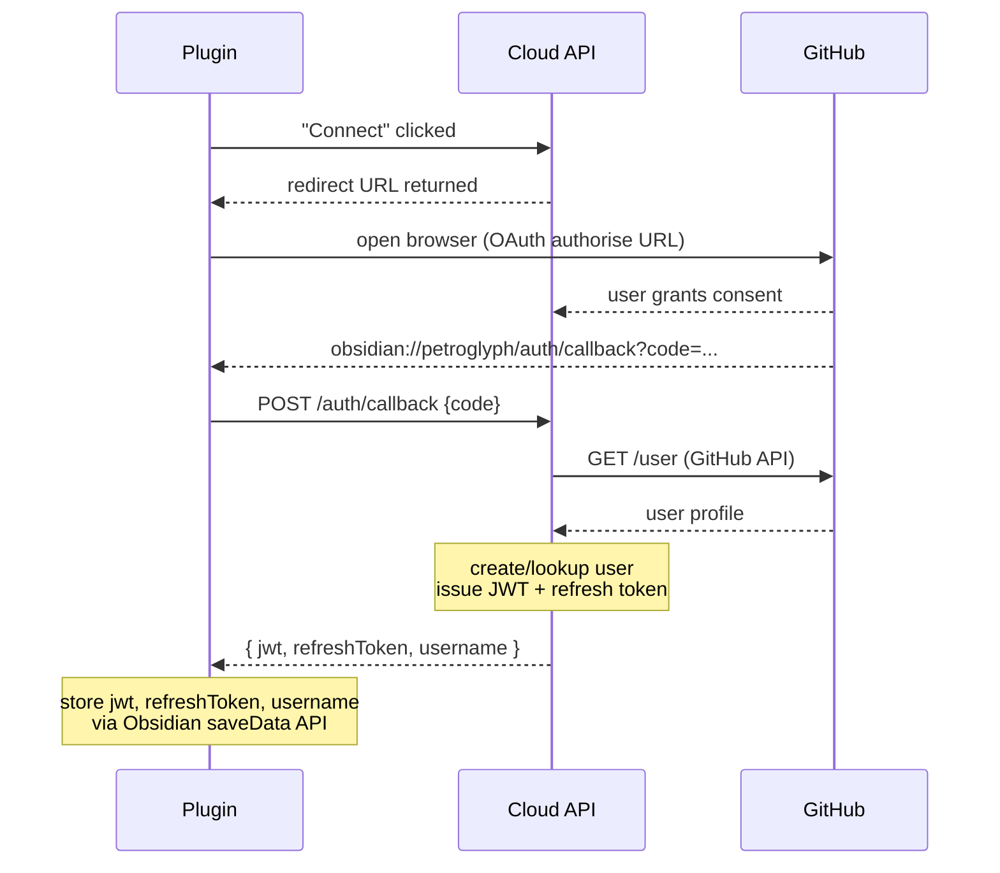
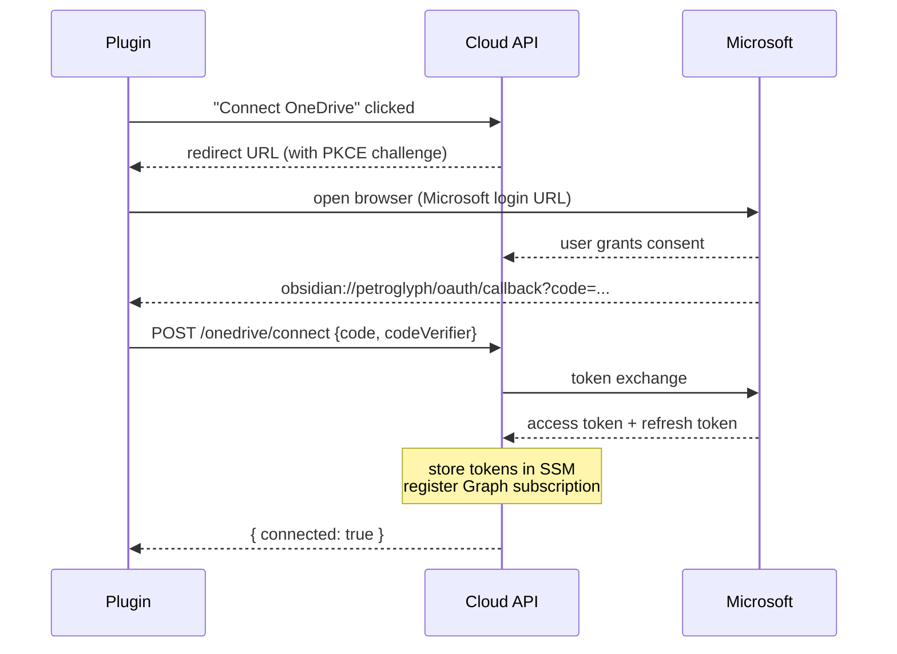
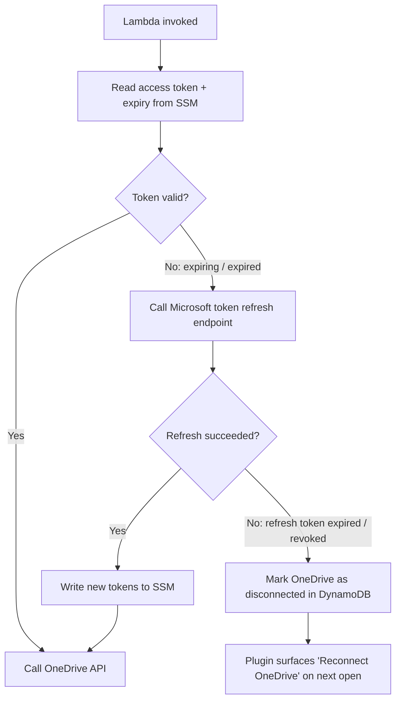

# Authentication & Identity

This document describes how authentication and identity work across Petroglyph — covering the plugin's login session, OneDrive access, and how both are managed throughout the application lifecycle.

---

## Overview

There are three distinct auth surfaces:

| Surface                      | Protocol                        | Purpose                                                          |
| ---------------------------- | ------------------------------- | ---------------------------------------------------------------- |
| **Plugin → Cloud API**       | GitHub OAuth + internal JWT     | User identity and session management                             |
| **Cloud Service → OneDrive** | Microsoft OAuth 2.0 (delegated) | Reading files from OneDrive via Microsoft Graph                  |
| **Sync Profiles**            | —                               | Per-user configuration stored in DynamoDB, shared across devices |

These surfaces are intentionally decoupled. Logging in with GitHub does not grant OneDrive access; connecting OneDrive is a separate step. This separation makes it straightforward to add other source providers (Dropbox, Google Drive) or other identity providers (Microsoft, email) in future phases.

---

## 1. Plugin Login — GitHub OAuth

The plugin uses GitHub as an identity provider to authenticate the user against the cloud API. The GitHub token is used only to verify identity; the cloud API owns the session from that point on.

### Flow



1. Plugin opens browser to GitHub's OAuth authorisation URL.
2. User grants consent on GitHub.
3. GitHub redirects to `obsidian://petroglyph/auth/callback?code=...`.
4. Obsidian's URI handler fires; plugin sends the code to `POST /auth/callback` on the cloud API.
5. Cloud API validates the state token against DynamoDB and **deletes it immediately** (making it one-time-use) before proceeding with the code exchange.
6. Cloud API exchanges the code for a GitHub access token, calls `GET /api.github.com/user` to retrieve the user's GitHub ID and username. Any failure from GitHub returns **502** to the plugin.
7. Cloud API creates (or looks up) the user record in DynamoDB. The GitHub token is discarded.
8. Cloud API issues:
   - A short-lived **JWT** (RS256, TTL 1 hour, claims: `iss=petroglyph-api`, `aud=petroglyph-plugin`, `sub=<userId>`, `username=<githubLogin>`).
   - A long-lived **refresh token** (opaque UUID, stored as **SHA-256 hash** in DynamoDB, TTL ~90 days).
9. Plugin stores `jwt`, `refreshToken`, and `username` via Obsidian's `saveData` API (written to the plugin's local data file — not `localStorage`).

### Session Lifecycle

GitHub OAuth App tokens do not expire — they stay valid until the user revokes access in their GitHub settings. The GitHub token is used only to verify identity and is **discarded immediately** after step 6 above; it is never stored.

What the service manages is its own session:

- All API calls include the JWT as a Bearer token.
- When the JWT expires (~1 hour), the plugin calls `POST /auth/refresh` with the refresh token to get a new JWT + new refresh token.
- Refresh tokens **rotate on use**: each refresh issues a new token and invalidates the previous one. A reused superseded token indicates a replay attack and immediately invalidates all active sessions for the user.
- Refresh tokens are stored hashed in DynamoDB with a TTL attribute; DynamoDB TTL handles expiry cleanup.
- When the cloud API refresh token expires, the plugin surfaces a "Re-connect your account" prompt on next open and re-initiates the GitHub OAuth flow.

### Client-Side JWT Auto-Refresh

Rather than waiting for an API call to fail with `401`, the plugin schedules a proactive refresh before the JWT expires.

**Scheduling**

On `onload` (and again after every successful refresh), the plugin decodes the JWT payload (base64, validated at runtime), reads the `exp` claim, and schedules a `window.setTimeout` to fire **5 minutes before expiry**. The delay is clamped to a minimum of `0` ms so that a token that is already within 5 minutes of expiry refreshes immediately.

On `onunload` the timer is cancelled.

**`POST /auth/refresh` contract**

| | Shape |
| --- | --- |
| Request body | `{ "refreshToken": "<opaque-uuid>" }` |
| Success response (`200`) | `{ "jwt": "<new-jwt>", "refreshToken": "<new-opaque-uuid>" }` |
| Failure response | `401` (token invalid / expired) or `5xx` (server error) |

On success the plugin calls `setCredentials` with the new `jwt` and `refreshToken`, persists them via `saveData`, and reschedules the next refresh timer.

**Failure behaviour**

If the refresh request returns a non-`2xx` status, or if the response body is malformed (e.g. missing `jwt` field), the plugin **silently discards the error and does not reschedule**. The session expires naturally; the next API call will return `401` and the plugin will surface the "Re-connect your account" prompt at that point.

### JWT Verification Middleware

All authenticated API routes are protected by `authMiddleware` (`packages/api/src/auth-middleware.ts`). For every request it:

1. Reads the `Authorization: Bearer <token>` header. Returns `401` if absent or malformed.
2. Calls `verifyJwt` (`packages/api/src/jwt.ts`), which:
   - Reads the RS256 public key from the `JWT_PUBLIC_KEY` environment variable, or falls back to SSM at `JWT_PUBLIC_KEY_SSM_PATH` (default: `/petroglyph/jwt/public-key`).
   - Caches the imported `CryptoKey` at module level so subsequent requests within the same Lambda process skip the fetch and import.
   - Verifies the token signature, algorithm (`RS256`), and required claims (`sub`, `username`).
3. On success, injects `userId` (from `sub`) and `username` into the Hono context variables, making them available to downstream route handlers as `c.var.userId` and `c.var.username`.
4. On any failure (missing token, invalid signature, expired token, missing claims), returns `401 { "error": "UNAUTHORIZED" }`.

### GET /status — Session Status Check

The plugin periodically calls `GET /status` to determine the current connection state of both GitHub (identity) and OneDrive (file source). The route is JWT-protected via the global `authMiddleware`.

**Response shape:**

```json
{
  "github": { "connected": true, "username": "<githubLogin>" },
  "oneDrive": { "connected": false }
}
```

| Field | Type | Description |
| ----- | ---- | ----------- |
| `github.connected` | boolean | Always `true` for an authenticated request — the JWT proves GitHub identity. |
| `github.username` | string | The GitHub login extracted from the JWT `username` claim. |
| `oneDrive.connected` | boolean | `true` if the user's OneDrive token is active; `false` if disconnected or never connected. |

Unauthenticated requests (missing or invalid JWT) return `401 { "error": "UNAUTHORIZED" }` from the auth middleware before the handler is reached.

The plugin uses this response to decide which UI prompts to surface — for example, a **"Reconnect OneDrive"** banner when `oneDrive.connected` is `false`.

### GitHub OAuth App Registration

| Field        | Value                                 |
| ------------ | ------------------------------------- |
| Type         | GitHub OAuth App (not a GitHub App)   |
| Callback URL | `obsidian://petroglyph/auth/callback` |
| Scopes       | `read:user`                           |

> The `read:user` scope is used only to retrieve the user's GitHub ID and public profile. No repository access is requested.

The OAuth client secret is stored in **SSM Parameter Store (SecureString)** and accessed by the API Handler Lambda at runtime.

---

## 2. OneDrive Connection — Microsoft OAuth 2.0

Connecting OneDrive is a separate, explicit step after logging in. It uses Microsoft's OAuth 2.0 authorisation code flow with PKCE, targeting delegated permissions.

### Entra ID App Registration

| Field                   | Value                                                |
| ----------------------- | ---------------------------------------------------- |
| Type                    | Multi-tenant, public client                          |
| Supported account types | Personal Microsoft accounts AND work/school accounts |
| Redirect URI            | `obsidian://petroglyph/oauth/callback`               |
| Scopes                  | `Files.Read offline_access`                          |

> Supports both personal accounts (outlook.com, hotmail.com, live.com) and work/school accounts (Microsoft 365 / Entra ID). Multi-tenant registration is required for personal account support.

The Entra ID client secret is stored in **SSM Parameter Store (SecureString)**.

### Flow



1. User clicks **"Connect OneDrive"** in plugin settings.
2. Plugin requests a redirect URL from the cloud API. The API generates a PKCE `code_verifier` and `code_challenge`, stores the verifier in DynamoDB temporarily, and returns the Microsoft authorisation URL.
3. Plugin opens the browser to Microsoft login.
4. User consents. Microsoft redirects to `obsidian://petroglyph/oauth/callback?code=...`.
5. Plugin sends the code to `POST /onedrive/connect` on the cloud API.
6. Cloud API completes the PKCE token exchange with Microsoft, receiving an **access token** (TTL ~1 hour) and a **refresh token** (TTL up to 90 days with `offline_access`).
7. Both tokens are stored in **SSM Parameter Store (SecureString)**.
8. Cloud API registers a **Microsoft Graph change notification subscription** for the configured OneDrive folder, using the fresh access token.
9. Plugin is notified the connection is active.

### Token Lifecycle

Access tokens expire approximately every hour. The service uses **lazy refresh**: any Lambda that requires OneDrive access checks the token expiry before use and proactively refreshes if within a threshold window (e.g. expiry < 10 minutes away). After refreshing, the new access and refresh tokens are written back to SSM atomically.



### Reconnection

If the refresh token expires or is revoked (e.g. user hasn't synced in 90 days, or revokes access in their Microsoft account settings):

- The cloud service marks the OneDrive connection as `disconnected` in the user's DynamoDB record.
- On the plugin's next status check, it detects the disconnected state and presents a **"Reconnect OneDrive"** prompt, explaining the reason (expired, revoked, etc.) and offering a button to re-initiate the consent flow.

### Subscription Lifecycle Notifications

Microsoft Graph change notification subscriptions expire every 3 days (maximum). Rather than a standing scheduled renewer, Petroglyph relies on Microsoft's **lifecycle notifications** to handle subscription state reactively.

Microsoft sends lifecycle events to a dedicated `lifecycleNotificationUrl`, handled by the **Lifecycle Notification Lambda** (separate from the webhook receiver):

| Lifecycle event           | Action                                                                                                                                                                                                         |
| ------------------------- | -------------------------------------------------------------------------------------------------------------------------------------------------------------------------------------------------------------- |
| `reauthorizationRequired` | Lambda attempts token refresh + subscription renewal automatically using the current OneDrive token. If renewal succeeds, no user action is needed. If it fails, marks OneDrive as `disconnected` in DynamoDB. |
| `subscriptionRemoved`     | Marks OneDrive as `disconnected` in DynamoDB immediately.                                                                                                                                                      |
| `missed`                  | Logs to CloudWatch; Processor Lambda will catch up on next manual sync.                                                                                                                                        |

In all `disconnected` cases the plugin surfaces a **"Reconnect OneDrive"** prompt on its next `/status` poll, explaining the reason. There is no SNS email alert — the plugin is the primary UI for error surfacing.

---

## 3. Sync Profiles

A **Sync Profile** binds a source (an OneDrive folder) to a destination (an Obsidian vault path) with associated settings. Profiles are stored server-side in DynamoDB so they are available across all plugin instances (e.g. home laptop and work laptop).

### Profile Shape

```typescript
interface SyncProfile {
  profileId: string; // UUID
  userId: string; // GitHub user ID
  name: string; // e.g. "Work Notes"
  source: {
    provider: "onedrive";
    folderPath: string; // e.g. "OnyxBoox/Work/"
    folderId: string; // Microsoft Graph item ID (stable across renames)
  };
  destination: {
    vaultPath: string; // e.g. "handwritten/work/"
  };
  settings: {
    conflictMode: "overwrite"; // OneDrive always wins (Phase 1)
    deletionMode: "sync" | "retain"; // configurable
  };
  createdAt: string; // ISO 8601
  updatedAt: string;
}
```

### Device Behaviour

- Each plugin instance selects **one active profile** from the user's profile list (Phase 1).
- The active profile ID is stored in the plugin's local settings.
- Profile _definitions_ (source, destination, settings) are always read from the cloud API, ensuring changes propagate across devices without manual reconfiguration.
- Future phases may allow multiple active profiles per vault.

---

## 4. DynamoDB Schema (Auth-Related Tables)

### `users`

| Attribute                  | Type        | Description                                        |
| -------------------------- | ----------- | -------------------------------------------------- |
| `userId`                   | String (PK) | GitHub user ID                                     |
| `githubUsername`           | String      | GitHub login name                                  |
| `oneDriveStatus`           | String      | `connected` \| `disconnected` \| `never_connected` |
| `oneDriveDisconnectReason` | String?     | `expired` \| `revoked` \| `error`                  |
| `createdAt`                | String      | ISO 8601                                           |

### `refresh_tokens`

This table is dual-purpose: it holds both long-lived refresh tokens (issued after login) and short-lived OAuth state tokens (issued by `GET /auth/url`). The `type` attribute discriminates between them.

| Attribute    | Type        | Description                                                                              |
| ------------ | ----------- | ---------------------------------------------------------------------------------------- |
| `token`      | String (PK) | Raw UUID for `oauth_state`; SHA-256 hash for `refresh_token`                             |
| `type`       | String      | `oauth_state` \| `refresh_token`                                                         |
| `userId`     | String?     | FK to `users` (present on `refresh_token` records; absent on `oauth_state`)              |
| `ttl`        | Number      | Unix timestamp used as DynamoDB TTL (10 minutes for state tokens, ~90 days for sessions) |
| `replacedBy` | String?     | Hash of the token that replaced this one — `refresh_token` only (rotation audit)         |

### `sync_profiles`

| Attribute     | Type         | Description                      |
| ------------- | ------------ | -------------------------------- |
| `userId`      | String (PK)  | FK to `users`                    |
| `profileId`   | String (SK)  | UUID                             |
| `name`        | String       | Human-readable profile name      |
| `source`      | Map          | Provider, folder path, folder ID |
| `destination` | Map          | Vault path                       |
| `settings`    | Map          | Conflict mode, deletion mode     |
| `createdAt`   | String       | ISO 8601                         |
| `updatedAt`   | String       | ISO 8601                         |

`userId` as partition key means all profiles for a user are co-located, making list-by-user the primary key query rather than a GSI scan.

---

## 5. SSM Parameter Store Layout

All parameters use the prefix `/petroglyph/`.

| Parameter                                   | Type         | Description                                                                   |
| ------------------------------------------- | ------------ | ----------------------------------------------------------------------------- |
| `/petroglyph/github/oauth/client-id`        | String       | GitHub OAuth App client ID                                                    |
| `/petroglyph/github/oauth/client-secret`    | SecureString | GitHub OAuth App client secret                                                |
| `/petroglyph/jwt/public-key`                | String       | RS256 public key (PEM) for verifying JWTs                                     |
| `/petroglyph/microsoft/entra/client-id`     | String       | Entra ID app client ID                                                        |
| `/petroglyph/microsoft/entra/client-secret` | SecureString | Entra ID app client secret                                                    |
| `/petroglyph/onedrive/access-token`         | SecureString | Current OneDrive access token                                                 |
| `/petroglyph/onedrive/refresh-token`        | SecureString | Current OneDrive refresh token                                                |
| `/petroglyph/onedrive/token-expiry`         | String       | ISO 8601 expiry of the access token                                           |
| `/petroglyph/onedrive/subscription-id`      | String       | Microsoft Graph subscription ID                                               |
| `/petroglyph/config/target-branch`          | String       | Git branch to commit to (e.g. `main`)                                         |
| `/petroglyph/config/initial-sync`           | String       | `true` \| `false` — return all existing files when plugin has no change token |
| `/petroglyph/config/retention-days`         | String       | Days to retain S3 objects after staging (default: `90`)                       |

> **Note:** In Phase 3 (multi-user), per-user OneDrive tokens and settings will move to DynamoDB. SSM is appropriate for a single-user personal deployment.

---

## 6. Security Considerations

- **Client secrets** never leave the cloud service. The Entra ID client secret and GitHub OAuth client secret are stored in SSM and only accessed by Lambda functions. The plugin never sees them.
- **PKCE** is used for the OneDrive OAuth flow, preventing authorisation code interception attacks even though the app is a public client.
- **Refresh token rotation** detects replay attacks: using a superseded refresh token immediately invalidates all active sessions for the user.
- **JWT key pair** uses RS256 (asymmetric). The public key is stored in SSM at `/petroglyph/jwt/public-key` (or overridden via `JWT_PUBLIC_KEY` env var) and is imported once at module level (cached for the lifetime of the Lambda process). Rotation of the key pair invalidates all active JWTs; users re-authenticate on the next API call via the refresh token.
- **SSM SecureString** parameters are encrypted at rest using AWS KMS. Access is restricted to the Lambda execution roles via IAM.
- **CSRF protection via server-side state tokens**: `GET /auth/url` generates a UUID state token, stores it in DynamoDB (`refresh_tokens` table, `type=oauth_state`, TTL 10 minutes), and includes it in the GitHub OAuth URL. The callback handler validates the state against DynamoDB and **deletes it before exchanging the code** (one-time-use), so the token cannot be replayed even if intercepted after the redirect. Validation survives any plugin restart or context loss during the OAuth redirect.
